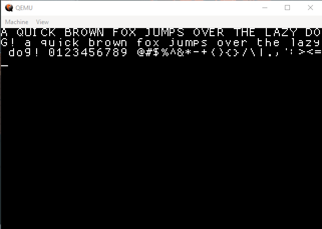

# 8086-Assembly-Fonts
Use different bitmap fonts in your Real Mode OS

# Building Instructions
To compile it: `./make.sh`  
To run it: `qemu-system-i386 -drive format=raw,file="test.img"`
# Credits
Font: ProggyFont
